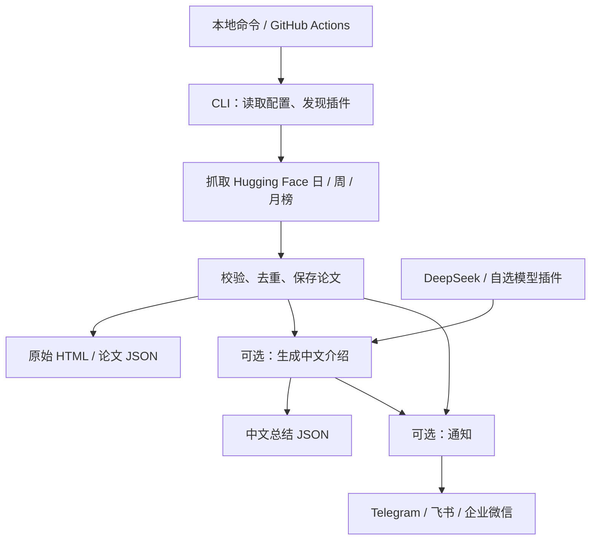
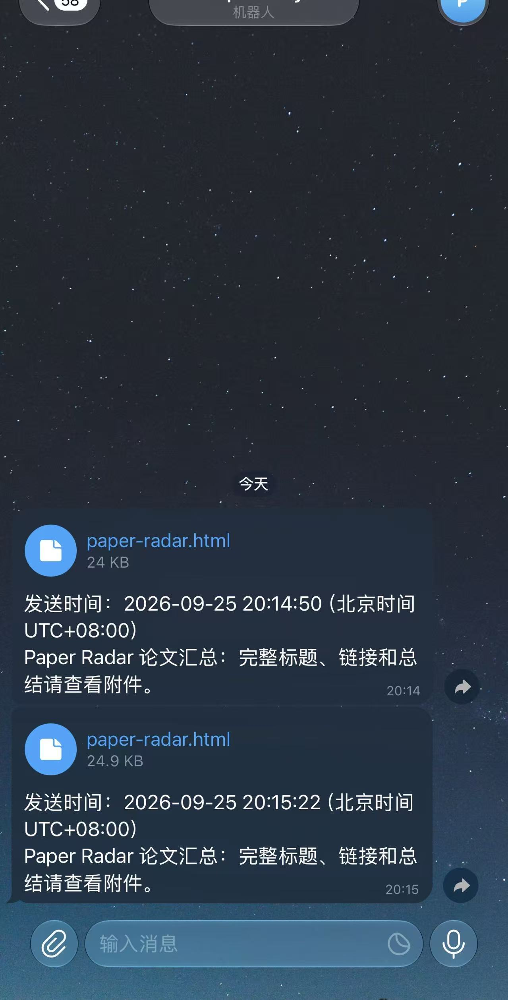
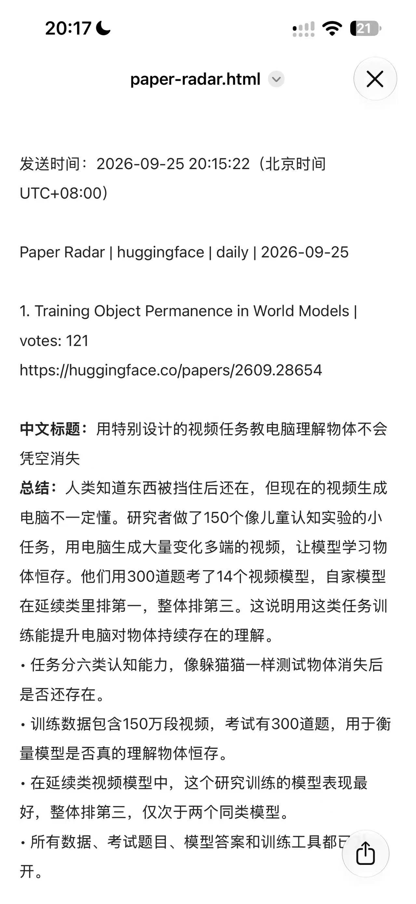

# Paper Radar

> **日榜日期说明：** 由于时差，Hugging Face 的当天日榜可能尚未发布，因此默认抓取北京时间昨天的数据。例如，北京时间 9 月 26 日运行时，会抓取 9 月 25 日的日榜。此规则适用于 GitHub Actions 定时运行和手动运行；周榜、月榜仍默认抓取本周、本月的数据。

抓取 Hugging Face Daily Paper日榜、周榜和月榜，用大白话生成中文介绍，并推送到 Telegram、飞书或企业微信。

**架构亮点：插件式扩展 + 自动扫包发现。** 这里借鉴了ioc 的思想 ，数据来源、总结模型和通知渠道通过统一接口接入，程序自动扫描对应 Python 包，发现具体实现，无需手动维护注册列表。新增插件时，只需实现对应接口、设置唯一名称并添加 `__init__.py`，即可被发现并按配置选用。

公共流程负责采集、去重、总结处理和结果保存，插件专注于具体平台或模型的对接。扩展来源、模型或推送渠道时，无需修改核心业务流程。存储层通过独立接口解耦，目前使用 JSON 实现。

## 快速开始

需要 Python 3.12+ 和 uv。在项目根目录执行：

```powershell
uv sync --frozen
# 首次配置时复制；已有 .env 则跳过，避免覆盖密钥。
Copy-Item .env.example .env
```

在 `.env` 填写模型和 Telegram 配置，密钥不要写入代码或提交到仓库：

```dotenv
SUMMARY_PROVIDER=deepseek
SUMMARY_MODEL=
API_KEY=你的模型密钥
SUMMARY_TIMEOUT=120
TELEGRAM_BOT_TOKEN=你的机器人令牌
TELEGRAM_CHAT_ID=你的聊天ID
```

`SUMMARY_MODEL` 留空使用项目默认模型 `deepseek-flash`，其余配置通常保持默认即可。

**抓取昨天的论文 → 中文介绍 → Telegram 推送：**

```sh
uv run paper-radar crawl huggingface daily --summarize --notify telegram
```

抓取、总结和通知默认处理全部论文。只有显式传入 `--top N` 时，通知才限制为前 N 篇。

## 常用命令

```sh
# 只抓取，不调用模型或发送消息
uv run paper-radar crawl huggingface daily

# 抓取日榜、周榜、月榜
uv run paper-radar crawl huggingface all

# 指定日期（周榜用 2026-W39，月榜用 2026-09）
uv run paper-radar crawl huggingface daily --target 2026-09-25

# 只为前 3 篇生成中文介绍
uv run paper-radar crawl huggingface daily --summarize --summary-limit 3

# 为已有快照生成总结；替换为实际文件路径
uv run paper-radar summarize "data/processed/papers/来源/周期/日期/快照.json"
```

不指定日期时，按配置时区（默认北京时间）抓取昨天的日榜、本周的周榜和本月的月榜；Actions 定时和手动运行均使用这一规则。可通过 `--target` 显式指定日期。当源站尚未发布对应榜单时，程序仍会报错，避免把其他日期的榜单存入目标日期。

## 总结与推送

中文介绍包含通俗标题、总结和要点，只依据论文标题与摘要，不读取全文。生成失败或缺少摘要会明确标记，其他论文继续处理。

Telegram 每个榜单只发一条消息：短报告直接显示，长报告作为 `paper-radar.html` 附件发送，打开后查看完整内容。论文之间留有空行和分隔线，**中文标题**、**总结**标签加粗。消息和附件均保留发送时间，使用北京时间，精确到秒。抓取 `all` 时三个榜单各发一条。

| 渠道     | 命令参数              | `.env` 配置                                          |
| -------- | --------------------- | ------------------------------------------------------ |
| Telegram | `--notify telegram` | `TELEGRAM_BOT_TOKEN`、`TELEGRAM_CHAT_ID`           |
| 飞书     | `--notify feishu`   | `FEISHU_WEBHOOK_URL`；签名开启时加 `FEISHU_SECRET` |
| 企业微信 | `--notify wechat`   | `WECHAT_WEBHOOK_URL`，不支持个人微信                 |

飞书和企业微信的长消息仍分段发送。重新运行会再次调用模型和发送通知；模型调用可能产生费用，当前不提供总结缓存。

## 整体架构



项目按职责分层，数据来源、总结模型和通知渠道采用插件式扩展；存储目前使用 JSON。

## 目录说明

以下源码子目录均位于 `src/paper_radar/`，`cli.py` 是命令入口。

| 源码目录            | 作用                                                            |
| ------------------- | --------------------------------------------------------------- |
| `core/`           | 论文、任务和总结的数据定义                                      |
| `config/`         | 读取和校验环境配置                                              |
| `infrastructure/` | HTTP 请求、插件发现等公共能力                                   |
| `sources/`        | 数据来源；`huggingface/` 实现三种榜单抓取                     |
| `services/`       | 组织抓取、去重、总结和通知流程                                  |
| `summarization/`  | 模型接口、公共请求逻辑，以及`deepseek/`、`compatible/` 实现 |
| `storage/`        | 论文和中文总结的文件读写                                        |
| `notifications/`  | `telegram/`、`feishu/`、`wechat/` 推送实现                |

| 其他目录                        | 作用                                       |
| ------------------------------- | ------------------------------------------ |
| `data/raw/`                   | 原始 HTML                                  |
| `data/processed/papers/`      | 结构化论文 JSON                            |
| `data/processed/summaries/`   | 中文总结 JSON                              |
| `tests/`                      | 自动化测试；`fixtures/` 保存离线页面样本 |
| `scripts/`                    | 历史榜单回填脚本                           |
| `.github/workflows/`          | 定时抓取与自动测试                         |
| `.claude/rules/`              | 开发规范                                   |
| `.venv/`、各类缓存、`dist/` | 工具生成的环境、缓存和构建产物             |

数据按“来源 / 周期 / 榜单日期”归档，例如：

```text
data/processed/papers/huggingface/daily/2026-09-25/2026-09-25_18-00-12.json
```

文件名记录实际抓取的北京时间；总结文件名记录总结完成时间。同秒重名追加序号，保留多次运行的历史结果。输出根目录可用 `DATA_DIR` 修改。

## GitHub Actions

`crawl.yml` 设置为北京时间每天 **06:00、12:00、18:00** 抓取日、周、月榜，并提交 `data/`。定时调度可能延迟。

在仓库的 **Settings → Secrets and variables → Actions** 配置：

| 类型     | 名称                   | 值                  |
| -------- | ---------------------- | ------------------- |
| Secret   | `API_KEY`            | 模型密钥            |
| Secret   | `TELEGRAM_BOT_TOKEN` | Telegram 机器人令牌 |
| Secret   | `TELEGRAM_CHAT_ID`   | 接收消息的聊天 ID   |
| Variable | `SUMMARIZE_ENABLED`  | `true`            |
| Variable | `NOTIFY_CHANNEL`     | `telegram`        |

可选变量：`SUMMARY_PROVIDER`、`SUMMARY_MODEL`、`SUMMARY_BASE_URL`。Actions 不读取本地 `.env`，仓库需允许 Actions 写入内容。

也可在 **Actions → Crawl papers → Run workflow** 手动选择周期、通知渠道和是否总结。当前工作流最长运行 15 分钟，通知默认包含每个榜单抓取到的全部论文。

## 切换模型与扩展

使用兼容 Chat Completions 和 JSON 输出的服务时，在 `.env` 设置：

```dotenv
SUMMARY_PROVIDER=compatible
SUMMARY_BASE_URL=https://your-model-service.example/v1
SUMMARY_MODEL=your-model-name
API_KEY=该服务的密钥
```

新增插件时，在对应目录实现接口并提供唯一 `name`：数据源实现 `PaperSource`，总结模型实现 `SummaryModel`，通知实现 `Notifier`。插件子包需有 `__init__.py`，程序会自动发现，无需修改注册列表。

## 测试

```sh
uv run pytest
uv run ruff check src tests
uv run mypy
```

普通测试不调用真实模型或发送通知。以下命令会向 `.env` 配置的 Telegram **实际发送一条历史样本报告**：

```sh
uv run pytest tests/test_telegram_live.py --send-telegram -v
```

测试结果


