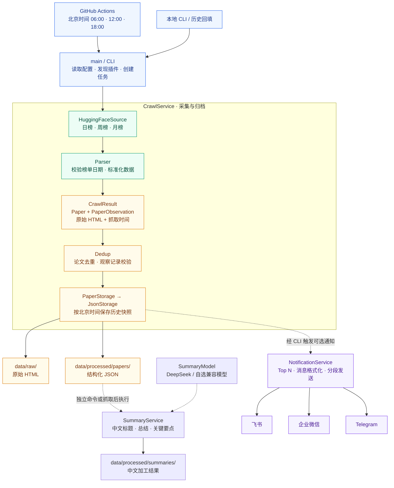

# Paper Radar

按[需求文档](https://chatgpt.com/share/6ab5c3e1-4d20-83ec-81cc-ce070a3ac657)的最终 v0.1 架构实现：Hugging Face 日／周／月榜 → 统一论文与观察记录 → 去重 → JSON 归档 → 可选通知。

## 整体架构

项目按“入口 → 采集 → 处理 → 存储 → 通知”组织。下图展示当前已实现的主流程；虚线表示 CLI 在数据保存成功后触发可选通知。



`core` 中的 Paper 表示论文实体，PaperObservation 表示某来源、某周期的榜单观察，CrawlTask 标识一次任务。Source 负责获取与标准化数据，Service 组织业务流程，Storage 保存数据，Notifier 对接推送渠道；领域模型不依赖这些具体实现。

公共能力由 `Settings`、插件发现模块和 `HttpClient` 提供，分别负责配置、收集 Source／Notifier 实现，以及 HTTP 请求、超时和重试。CLI 负责装配这些依赖；JsonStorage 本身不调用通知服务。

架构中的扩展位置与实现状态如下：

| 层次 | 当前已实现 | 后续扩展方向（未实现） |
| --- | --- | --- |
| 数据来源 | HuggingFaceSource，支持自动发现 | ArxivSource、SemanticScholarSource |
| 数据处理 | 论文去重、榜单排名与点赞记录、通知 Top N 选择 | 综合评分 Ranking、趋势分析 Trend |
| 存储 | PaperStorage 接口、JsonStorage | SQLite、PostgreSQL |
| 通知 | 飞书、企业微信、Telegram | 在 Notifier 接口下添加其他渠道 |

## 运行

需要 Python 3.12+ 和 uv。在项目根目录执行：

```sh
uv sync --frozen
uv run paper-radar sources
uv run paper-radar notifiers
uv run paper-radar crawl huggingface daily --target 2026-09-24
uv run paper-radar crawl huggingface weekly --target 2026-W39
uv run paper-radar crawl huggingface monthly --target 2026-09
uv run paper-radar crawl huggingface all
```

未传 `--target` 时按 `TIMEZONE` 当前日期生成目标，默认 Asia/Shanghai；周榜使用 ISO 周年。`all` 顺序执行三个任务，其中一个失败仍执行其余任务，最终返回非零退出码。`all` 不接受 `--target`。

**Hugging Face 可能把尚未发布或无榜单的日期返回为前一个有数据的日期。程序会报错，不会将旧榜单标成新日期。** 当日尚未发布时可显式选择已发布日期；回填遇到这种日期也会报告失败。

```sh
uv run python scripts/backfill.py 2026-09-21 2026-09-24
uv run paper-radar crawl huggingface daily --target 2026-09-24 --data-dir ./archive
```

## 目录说明

下面是项目的实际目录。源码、测试样本和采集结果分别存放；虚拟环境、缓存和构建产物由工具生成。

```text
paper-radar/
├── .claude/
│   └── rules/                    开发规范
├── .github/
│   └── workflows/                GitHub Actions 工作流
├── src/
│   └── paper_radar/              Python 应用包
│       ├── core/                领域模型与任务定义
│       ├── config/              运行配置
│       ├── infrastructure/      HTTP 和插件发现公共能力
│       ├── sources/             论文来源接口与加载入口
│       │   └── huggingface/     Hugging Face 三种榜单的实现
│       ├── services/            业务流程编排
│       ├── summarization/       可替换的中文总结模型适配器
│       ├── storage/             存储接口与 JSON 实现
│       └── notifications/       通知接口与加载入口
│           ├── feishu/          飞书机器人
│           ├── wechat/          企业微信群机器人
│           └── telegram/        Telegram Bot
├── scripts/                     批量操作脚本
├── tests/                       自动化测试
│   └── fixtures/
│       └── huggingface/         真实榜单页面测试样本
├── data/                        默认采集输出目录
│   ├── raw/
│   │   └── huggingface/
│   │       ├── daily/           日榜原始 HTML
│   │       ├── weekly/          周榜原始 HTML
│   │       └── monthly/         月榜原始 HTML
│   └── processed/
│       ├── summaries/           中文总结，按来源 / 周期 / 目标分目录
│       └── papers/
│           └── huggingface/
│               ├── daily/       日榜结构化 JSON
│               ├── weekly/      周榜结构化 JSON
│               └── monthly/     月榜结构化 JSON
├── dist/                        构建生成的安装包
├── .venv/                       uv 创建的虚拟环境
├── .pytest_cache/               pytest 缓存
├── .mypy_cache/                 mypy 缓存
└── .ruff_cache/                 Ruff 缓存
```

### `.claude/rules/`：开发规范

保存协作开发时遵循的规则。`code-for-humans-v13.md` 要求先理解执行路径、保持职责边界、优先复用现有实现，并在完成修改后验证结果。该目录供开发者和编码助手参考，不参与程序运行。

### `.github/workflows/`：自动执行与持续检查

`crawl.yml` 负责定时或手动启动 CLI、注入仓库配置与 Secrets，并将抓取结果提交到仓库。抓取时间为北京时间每天 06:00、12:00、18:00，解析与去重逻辑仍由 Python 代码负责。

`test.yml` 在代码推送和拉取请求时运行测试、Ruff 和 mypy。只涉及 `data/` 的更新会被忽略，避免每次数据提交都重复触发代码检查。修改调度、CI 命令或工作流权限时，应修改这个目录。

### `src/paper_radar/`：应用源码与入口

`src/` 是源码根目录，`paper_radar/` 是安装后可导入的 Python 包。包根目录的 `cli.py` 解析命令参数、读取配置、装配 Source／Storage／Notifier，并创建和执行任务；`__main__.py` 支持 `python -m paper_radar`，`main.py` 支持 `python -m paper_radar.main`，两者都调用同一 CLI。

各源码子目录的 `__init__.py` 将目录标记为 Python 包，来源与通知子包也因此可以被自动发现。下面各层分别承担明确的职责。

### `src/paper_radar/core/`：领域模型与业务约束

这是各模块共享的数据定义层，不依赖 HTTP、JSON 文件或通知平台。

| 文件 | 作用 |
| --- | --- |
| `models.py` | 定义论文实体 Paper、榜单观察 PaperObservation，以及带有抓取时间 fetched_at 的 CrawlResult。 |
| `tasks.py` | 定义 Period 和 CrawlTask，校验日期／周／月格式，计算默认目标和任务唯一键。 |
| `exceptions.py` | 定义 RadarError，表示可向用户报告的预期运行失败。 |

需要调整统一数据模型或任务约束时修改这里；某个平台特有的字段解析应放在对应 Source 中。

### `src/paper_radar/config/`：配置读取

`settings.py` 从项目根目录 `.env` 和环境变量读取数据目录、HTTP 超时、重试次数、请求间隔、User-Agent、时区和日志级别，并校验配置。已有环境变量优先于 `.env`。

这是公共运行参数的入口。通知凭据由各 Notifier 在实例化时读取，因此只抓取、不通知时不需要配置任何机器人凭据。

### `src/paper_radar/infrastructure/`：共享基础能力

| 文件 | 作用 |
| --- | --- |
| `http_client.py` | 管理 HTTP 连接、超时、请求头、GET 限速与重试、Retry-After，以及通知 POST 的响应读取。POST 不自动重试。 |
| `discovery.py` | 扫描受信任的 Python 包，收集具体插件子类，校验插件名称并拒绝重名。 |

来源与通知渠道共用这里的能力。这个目录不决定抓哪一个榜单、如何给论文去重或推送哪些论文。

### `src/paper_radar/sources/`：论文来源扩展入口

`base.py` 定义 PaperSource 接口，约定 Source 接收 CrawlTask 并返回 CrawlResult；`loader.py` 调用公共发现机制，收集 `sources/` 下的实现。

每个来源放在独立子包中。新增来源时实现 PaperSource，并提供唯一的 `name` 和包文件 `__init__.py`，即可被 `paper-radar sources` 发现。Source 只获取和标准化数据，不直接保存文件或发送通知。

### `src/paper_radar/sources/huggingface/`：Hugging Face 适配

| 文件 | 作用 |
| --- | --- |
| `urls.py` | 根据任务生成 `/papers/date/`、`/papers/week/` 或 `/papers/month/` 地址。 |
| `source.py` | 实现 HuggingFaceSource，通过共享 HttpClient 请求页面，再调用解析器。 |
| `parser.py` | 读取 HTML 中的 DailyPapers 结构化数据，校验榜单周期与日期，将论文和热度记录转换成领域模型。 |

日／周／月榜共用这套实现，通过任务的 period 区分。Hugging Face 页面结构变化时，优先检查 `parser.py` 并更新相应测试样本；解析器本身不发网络请求。

### `src/paper_radar/services/`：业务流程

| 文件 | 作用 |
| --- | --- |
| `crawl_service.py` | 串联 Source 抓取、去重和 Storage 保存，记录任务状态、耗时、论文数和重试次数。 |
| `dedup_service.py` | 按 canonical_id 去重，保留重复观察中较好的排名，并校验论文与观察记录的对应关系。 |
| `notification_service.py` | 按榜单排名选择 Top N，生成消息、按字节长度分段，依次调用各通知渠道并汇总失败。 |

`summary_service.py` 接收论文列表和 SummaryModel，逐篇生成中文内容并记录成功、失败或缺少摘要的跳过状态，不依赖爬虫或文件系统。业务步骤顺序的调整放在这一层；网站字段解析、JSON 写入细节和平台消息协议分别由下层实现负责。当前没有综合评分服务。

### `src/paper_radar/summarization/`：模型适配

`base.py` 定义 SummaryModel SPI；`loader.py` 复用公共 discovery 自动扫描具体实现，并按 SUMMARY_PROVIDER 创建插件。CLI 只依赖加载入口，将模型注入 SummaryService，最后统一调用 close 释放资源。

`chat_completions.py` 是抽象的公共协议实现，复用提示词、鉴权、请求和中文 JSON 响应校验，不参与插件注册。`deepseek/provider.py` 提供默认模型、官方地址及 DeepSeek 专用参数；`compatible/provider.py` 校验用户配置的模型与地址。提供方列表不写死在配置或 CLI 中。

查看已发现的插件：

```sh
uv run paper-radar summary-models
```

新增兼容协议的模型插件，只需新增 `summarization/my_provider/__init__.py` 和 `provider.py`。下面示例复用已有兼容实现，模型名称和地址由环境配置提供：

```python
from paper_radar.summarization.compatible.provider import CompatibleSummaryModel


class MySummaryModel(CompatibleSummaryModel):
    name = "my_provider"
```

设置 SUMMARY_PROVIDER=my_provider、SUMMARY_MODEL、SUMMARY_BASE_URL 和 API_KEY 后即可使用，无需修改 CLI 或注册表。插件名称必须唯一，重名会明确报错；只扫描本项目受信任的 summarization 包。

不同协议的插件直接继承 SummaryModel，实现 `create(settings)` 和 `summarize(paper)`，并设置 provider、model、base_url 元信息。create 负责自身配置和客户端初始化；summarize 返回 ChineseSummary，预期错误转换为 RadarError，错误消息不得包含密钥或完整敏感响应。插件负责校验自身协议的响应；抓取、逐篇处理、状态记录与结果保存仍由公共流程负责。拥有连接等资源时重写 close；无资源插件可使用默认实现。

`config/summary_settings.py` 独立管理模型配置，仅在启用总结时校验密钥。`core/summaries.py` 定义中文内容与处理状态。`storage/summary_storage.py` 读取已有论文快照并保存中文结果，`storage/json_files.py` 为论文和总结存储共用的 JSON 序列化、原子写入能力。

### `src/paper_radar/storage/`：数据落盘

`base.py` 定义 PaperStorage 的保存接口；`json_storage.py` 实现 JsonStorage，将原始 HTML 和结构化 JSON 写到数据目录。它负责目录创建、序列化、临时文件写入和原子替换，以任务键确定目录、以实际抓取时间确定文件名，保留多次抓取的历史结果。

存储层接收已处理的结果，不进行网络抓取或论文排名。以后增加其他存储方式时，在这里实现 PaperStorage，并在 CLI 中装配；当前存储没有自动发现机制。

### `src/paper_radar/notifications/`：通知渠道

`base.py` 定义 Notifier 接口，并提供必需环境变量与 HTTPS Webhook 地址校验；`loader.py` 发现通知子包中的具体实现。

| 子目录 | 主要文件与职责 |
| --- | --- |
| `feishu/` | `notifier.py` 组装飞书文本消息，按配置生成签名，检查平台返回码。 |
| `wechat/` | `notifier.py` 对接企业微信群机器人 Webhook，发送文本并检查 errcode；不支持个人微信。 |
| `telegram/` | `notifier.py` 校验 Bot Token，调用 sendMessage，将消息发送到配置的 chat_id 并检查 ok 字段。 |

这些目录只处理各平台的请求协议与结果判断。选择论文、消息排版和分段由 NotificationService 统一负责。新增渠道时添加独立子包并实现 Notifier。

### `scripts/`：批量操作入口

`backfill.py` 遍历起止日期，为每一天调用现有 CLI 回填日榜。它复用相同的抓取、校验和保存流程，不另外实现爬虫，也不发送通知。以后需要额外的维护或批量操作入口时，可以放在这里，共享业务逻辑仍应保留在源码包中。

### `tests/` 与 `tests/fixtures/huggingface/`：自动化验证

当前测试文件直接放在 `tests/`，没有额外划分 unit／integration 目录。

| 文件或目录 | 验证内容或用途 |
| --- | --- |
| `test_cli.py` | 插件列表、非法参数，以及批量任务部分失败后继续执行的行为。 |
| `test_crawl.py` | 三种榜单解析、错期拒绝、任务日期、去重、插件发现、采集到存储流程和写入失败保护。 |
| `test_storage.py` | 快照命名、北京时间跨日换算、三个周期归档、同秒多次抓取、重复保存与历史数据保护。 |
| `test_http_notifications.py` | HTTP 重试、通知负载、平台错误、消息长度、敏感信息保护和多渠道失败隔离。 |
| `fixtures/` | 固定的测试输入，不是运行时采集输出。 |
| `fixtures/huggingface/` | 保存 daily.html、weekly.html、monthly.html 三份真实页面组件样本，供离线解析测试使用。 |

测试通过模拟 HTTP 响应验证网络调用，不会向真实群聊发送消息。修改某层行为时，应在对应测试文件中补充或调整验证；不要用新抓取结果直接覆盖样本而忽略数据结构变化。

### `data/`：采集结果

这是默认输出根目录，可通过 `DATA_DIR` 或 CLI 的 `--data-dir` 修改；需要写入时自动创建相应子目录。

| 子目录 | 内容与用途 |
| --- | --- |
| `raw/` | 原始 HTML，可用于排查网站响应与解析差异。 |
| `raw/huggingface/` | Hugging Face 来源的原始响应，按 daily／weekly／monthly 分开。 |
| `processed/` | 处理后的结构化结果根目录。 |
| `processed/papers/` | 论文及榜单观察的任务快照。 |
| `processed/papers/huggingface/` | Hugging Face 的 JSON 快照，同样按 daily／weekly／monthly 分开。 |

两种数据树中的 `daily/` 按榜单日期 `YYYY-MM-DD` 建子目录，`weekly/` 按 `YYYY-Www`，`monthly/` 按 `YYYY-MM`。每次抓取在对应目录中生成独立文件，文件名使用实际抓取的北京时间，格式为 `YYYY-MM-DD_HH-mm-ss.json`，例如 `2026-09-25_06-00-12.json` 表示 9 月 25 日 06:00:12。文件名省略微秒和时区，完整精度与时区保留在 JSON 的 fetched_at 中。同一秒内不同抓取追加 `-2`、`-3` 等序号，避免覆盖。原始 HTML 使用相同文件名，扩展名为 `.html`；保存中断留下的孤立 HTML 也不会被新的抓取覆盖。

### 工具生成目录

| 目录 | 作用 |
| --- | --- |
| `.venv/` | `uv sync` 创建的项目虚拟环境，包含 Python 运行入口与依赖。 |
| `.pytest_cache/` | pytest 保存的运行状态，例如上次失败的测试信息。 |
| `.mypy_cache/` | mypy 的增量类型检查缓存。 |
| `.ruff_cache/` | Ruff 的检查缓存。 |
| 各级 `__pycache__/` | Python 导入或运行模块时生成的字节码缓存。 |
| `dist/` | `uv build` 生成的源码压缩包和 wheel 安装包。 |

这些目录均在 `.gitignore` 中排除，无需手动编辑或提交。它们可以由相应工具重新生成；`data/` 则是需要归档的业务数据，不属于缓存。

### 根目录配置文件

| 文件 | 作用 |
| --- | --- |
| `pyproject.toml` | 项目元信息、Python 版本要求、依赖、CLI 命令注册、构建方式及测试／检查工具配置。 |
| `uv.lock` | 锁定依赖解析结果，供本地和 CI 一致安装。 |
| `.python-version` | 指定 uv 使用的 Python 版本。 |
| `.env.example` | 可复制的配置模板，不包含真实凭据。 |
| `.env` | 用户本地配置，按需从模板创建，不提交到 Git。 |
| `.gitignore` | 排除凭据文件、虚拟环境、缓存和构建产物。 |
| `README.md` | 项目架构、目录职责、运行方法与维护说明。 |

## 数据与边界

Source 返回 `CrawlResult(papers, observations, raw_html, fetched_at)`，修正文档示意接口只返回 Observation、无法保存论文实体的问题。fetched_at 是带时区的实际抓取时间，Hugging Face 解析器用同一时间记录本次各条观察的 observed_at，去重和保存过程保持该时间不变；空榜单也有 fetched_at。arXiv ID 统一为 `arxiv:2609.26780`，版本后缀不参与实体去重。榜单 rank 是页面返回顺序，score 是抓取时的点赞数，不能理解成该周期新增点赞。

```text
data/raw/huggingface/daily/2026-09-24/2026-09-25_06-00-12.html
data/processed/papers/huggingface/daily/2026-09-24/2026-09-25_06-00-12.json
data/processed/papers/huggingface/daily/2026-09-24/2026-09-25_12-00-08.json
data/processed/papers/huggingface/daily/2026-09-24/2026-09-25_18-00-15.json
data/processed/papers/huggingface/weekly/2026-W39/2026-09-25_18-00-15.json
data/processed/papers/huggingface/monthly/2026-09/2026-09-25_18-00-15.json
```

原始页面保留为真实 HTML；新 JSON 使用 schema_version 2，包含 task、fetched_at、papers 和 observations，顶层 fetched_at 以北京时间 ISO 8601 格式保存。目录中的榜单周期与文件名中的抓取时间分别表达“哪期榜单”和“何时获取”，历史回填也遵循这一规则。文件名固定使用 Asia/Shanghai，TIMEZONE 配置仍只决定默认任务目标日期。论文与榜单观察分开，日／周／月分别存档，同一论文的不同榜单记录不会被去掉。去重范围为单个任务；跨任务可按 canonical_id 关联，不维护容易丢失并发更新的全局 JSON 索引。

同一个任务重新抓取会按新的 fetched_at 创建快照，保留每天 06:00、12:00、18:00 各次运行的结果；文件名记录实际时间，不假定调度准点。重复保存同一个 CrawlResult 则使用同一路径，不额外生成副本。每个文件先写临时文件再原子替换；processed JSON 是完整的权威任务快照。raw 和 processed 两个文件不具有跨文件事务保证。v0.1 按单进程使用，GitHub Actions 使用 concurrency 串行化任务。

此前生成的 `daily/2026-09-24.json` 等 schema_version 1 文件，以及带微秒和时区的旧文件名均保留原样，不自动迁移或删除；后续抓取使用简化后的文件名。历史快照目前不自动清理。

新增来源：在 `sources/<name>/source.py` 中实现 `PaperSource`，提供唯一 `name`，构造器接受共享 HttpClient；添加 `__init__.py` 即可自动发现。新增通知同理实现 `Notifier`。只扫描本项目受信任包，不加载任意外部插件。新增存储实现 `PaperStorage.save`，在 CLI 装配；目前只有 JSON，不额外设计存储注册框架。

复杂评分、其他论文来源、数据库和分布式执行属于后续范围，未添加空实现。

## 中文总结

总结模块基于已抓取的标题和摘要生成中文标题 `title_zh`、中文总结 `summary_zh` 和关键要点 `key_points`，不读取论文全文。结构化采集结果继续存于 `processed/papers/`，加工后的中文结果单独存于 `processed/summaries/`，不会修改原始快照。

在 `.env` 中配置：

```dotenv
SUMMARY_PROVIDER=deepseek
API_KEY=你的密钥
SUMMARY_MODEL=deepseek-flash
SUMMARY_TIMEOUT=120
```

默认模型使用 DeepSeek 官方当前提供的 `deepseek-flash`；也可用 `--summary-model` 指定其他可用模型。接口采用 [DeepSeek Chat Completions](https://api-docs.deepseek.com/api/create-chat-completion/) 和 [JSON Output](https://api-docs.deepseek.com/guides/json_mode/)。

独立处理已有快照，无需重新抓取：

```sh
uv run paper-radar summarize data/processed/papers/huggingface/daily/2026-09-25/2026-09-25_09-59-25.json
```

抓取后执行总结，或先用少量论文验证：

```sh
uv run paper-radar crawl huggingface daily --summarize
uv run paper-radar crawl huggingface daily --summarize --summary-limit 3
```

默认处理全部论文，`--summary-limit N` 只处理列表前 N 篇，与通知参数 `--top` 无关。启用后会把论文标题和摘要提交到所选模型服务，可能产生 API 费用。普通 crawl 命令不调用模型，也不要求模型密钥。

自选兼容服务需要支持 `/chat/completions`、JSON object 输出及当前请求参数，在 `.env` 中设置：

```dotenv
SUMMARY_PROVIDER=compatible
SUMMARY_BASE_URL=https://your-model-service.example/v1
SUMMARY_MODEL=your-model-name
API_KEY=你的密钥
```

程序在 BASE_URL 后追加 `/chat/completions`。允许 HTTPS 服务以及本机 HTTP 服务。所有提供方统一读取 API_KEY，切换服务时须同时填写该服务对应的密钥。`--summary-provider` 和 `--summary-model` 优先于环境配置。默认输出上限为 2048 tokens，需要时可额外设置 SUMMARY_MAX_TOKENS；默认 DeepSeek 配置不需要 SUMMARY_BASE_URL。

输出路径示例：

```text
data/processed/summaries/huggingface/daily/2026-09-25/2026-09-25_12-05-30.json
```

文件名是总结完成的北京时间，同秒重名追加序号。文件记录来源任务、原始抓取时间 `source_fetched_at`、总结时间、提供方、模型名和各论文处理状态。每篇结果保留 paper_id 和原始标题，可与原始论文快照关联。

- `success`：模型返回通过结构与中文内容检查的结果。
- `skipped`：原始摘要为空，记录原因，不编造总结。
- `failed`：网络或模型响应失败、输出截断、JSON 无效或缺少中文字段；继续处理其他论文，最终保存部分结果并返回非零退出码。

格式校验不能保证模型事实完全准确，重要内容应对照原始摘要。模型 POST 不自动重试；重新执行会重新调用模型并产生新的结果文件，当前不提供总结缓存或断点续跑。通知仍发送原有榜单内容，尚未改为中文总结消息。

GitHub Actions 手动触发时可勾选 summarize；定时任务需设置仓库变量 `SUMMARIZE_ENABLED=true` 和 Secret `API_KEY`。可通过仓库变量 SUMMARY_PROVIDER、SUMMARY_MODEL、SUMMARY_BASE_URL 和 Secret API_KEY 切换兼容服务。未开启时保持普通抓取；大量论文的顺序总结可能超过工作流的 15 分钟超时，此时可先抓取，再本地按快照独立总结。

`tests/test_summaries.py` 使用模拟模型接口验证请求协议、模型切换、错误响应、服务解耦和结果存储，不会在测试中调用付费服务。

## 通知与配置

复制 `.env.example` 为 `.env`，环境变量优先于文件。HTTP_TIMEOUT 单位秒，MAX_RETRIES 是首次 GET 失败后的重试次数，REQUEST_INTERVAL 是源站请求最短间隔。遇到 408、429、500、502、503、504 或传输失败执行退避，尊重 Retry-After；超过 300 秒的服务器等待要求直接报错，留待下次运行。

| 渠道 | 配置 |
| --- | --- |
| 飞书自定义机器人 | FEISHU_WEBHOOK_URL；启用签名时另设 FEISHU_SECRET |
| 企业微信群机器人 | WECHAT_WEBHOOK_URL（不支持个人微信） |
| Telegram Bot | TELEGRAM_BOT_TOKEN、TELEGRAM_CHAT_ID |

```sh
uv run paper-radar crawl huggingface weekly --notify feishu --notify telegram --top 10
```

默认不通知。仅传入 `--notify` 才发送，重复渠道自动合并。消息按 UTF-8 字节切分并限速，检测 HTTP 和平台业务错误。POST 不重试，避免服务器已接收但客户端超时后的重复投递。任务重跑会再次通知，不提供消息幂等性。通知失败不回滚已存档数据，各渠道独立尝试，最后返回失败。

接口参考：[飞书机器人](https://open.feishu.cn/document/client-docs/bot-v3/add-custom-bot)、[企业微信机器人](https://developer.work.weixin.qq.com/document/path/91770)、[Telegram Bot API](https://core.telegram.org/bots/api#sendmessage)。

## GitHub Actions

上传仓库后，`crawl.yml` 每天北京时间 **06:00、12:00、18:00** 执行当前日／周／月任务，并提交 data 目录。工作流使用 UTC cron `0 4,10,22 * * *`，分别对应北京时间 12:00、18:00 和次日 06:00；任务目标日期仍按 Asia/Shanghai 计算。GitHub Actions 调度可能延迟，不保证准点启动。当前日榜尚未发布时会失败提示，成功的周／月榜仍会保存并提交。可通过 workflow_dispatch 指定单一周期和历史目标。

自动通知需在仓库变量 `NOTIFY_CHANNEL` 设置一个渠道名，在 Secrets 中填入对应凭据；默认 none。手动触发可选择通知渠道。仓库需允许 Actions 写入内容；分支保护不允许机器人直接 push 时，提交步骤会失败，不会绕过保护。当前本地目录不包含 Git 仓库，工作流尚未在线运行。

安装步骤遵循 [uv 的 GitHub Actions 文档](https://docs.astral.sh/uv/guides/integration/github/)，使用锁文件及固定 Action 提交。测试工作流运行离线测试，不访问通知服务。

## 验证

```sh
uv run pytest
uv run ruff check .
uv run ruff format --check .
uv run mypy
uv build
```

测试 fixtures 保留 2026-09-25 抓取的真实 DailyPapers 组件及完整 data-props，删除无关页面外壳；对应日榜 2026-09-24、周榜 2026-W39、月榜 2026-09。覆盖三个周期解析、错期拒绝、URL、去重、存储、GET 重试、通知负载和错误处理。网络抓取需要单独使用 CLI 验证，凭据不可写入代码或提交到仓库。
